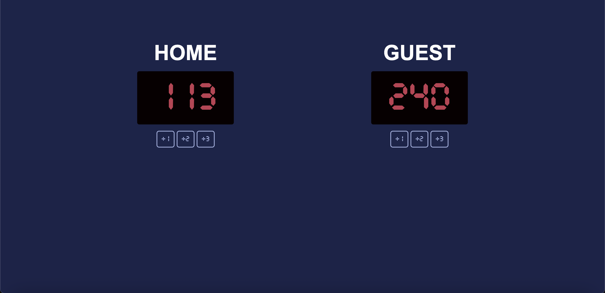

# 🏀 Basketball Scoreboard

[Visit the website here](https://basketball-scoreboard-lovat.vercel.app/)

A simple interactive basketball scoreboard built with **HTML, CSS, and JavaScript**. Track scores for **Home** and **Guest** teams with **+1, +2, and +3 buttons**.

---

## Features

- Increment **Home** and **Guest** scores individually.  
- Big, visually clear scoreboard numbers.  
- Fully responsive layout using **flexbox**.  
- Clean, reusable JavaScript function to handle all button clicks.  

## 🛠️ Tech Stack

- HTML5 – Structure
- CSS3 – Styling
- Vanilla JavaScript – Logic

## 📬 Let's Connect
[](https://codeharman.vercel.app/)
[](https://www.linkedin.com/in/codeharman/)
[-000000?style=flat&logo=x&logoColor=white)](https://x.com/codeharmann)
[](mailto:iamsingh.hj@email.com)


---

## Demo

  
---

## Installation

1. Clone the repository:

git clone https://github.com/codeharman/Basketball-Scoreboard.git

## Navigate to the project folder:

- cd basketball-scoreboard
- Open index.html in your browser.


## Usage

Click the +1, +2, +3 buttons under each team to update the score.

The scoreboard updates in real-time.

# Code Structure

```
basketball-scoreboard/
├─ index.html        # Main HTML file
├─ styles.css        # Styling for scoreboard
├─ scoreboard.js     # JavaScript for updating scores
└─ README.md
